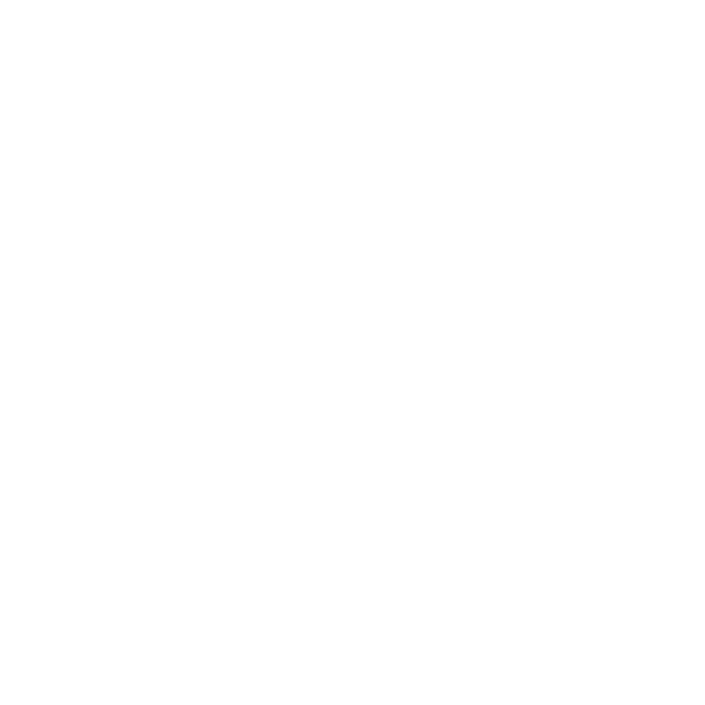
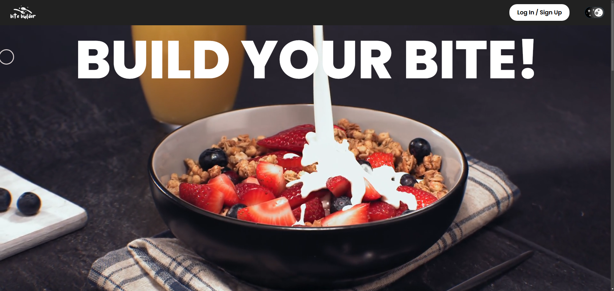
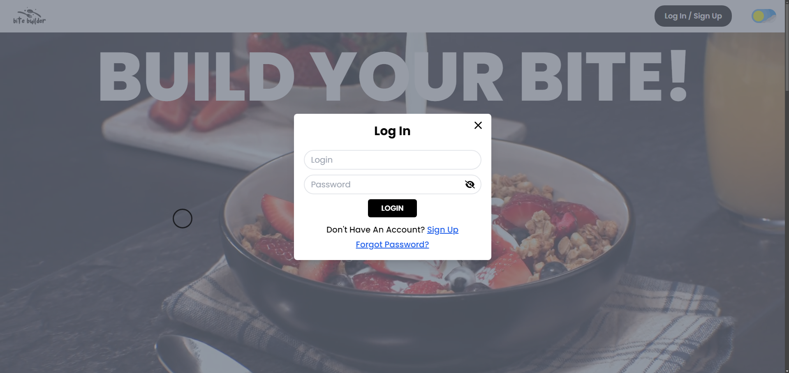
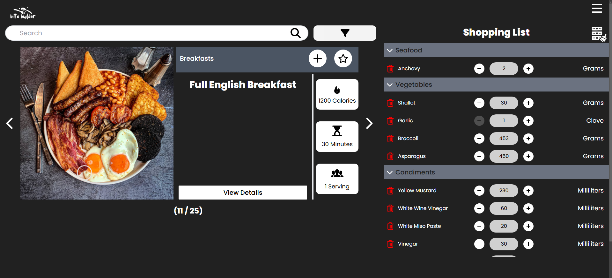
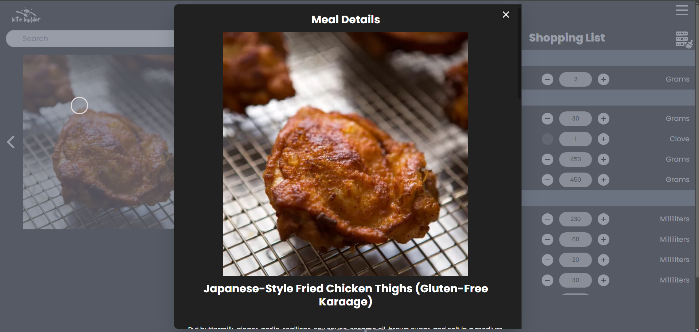
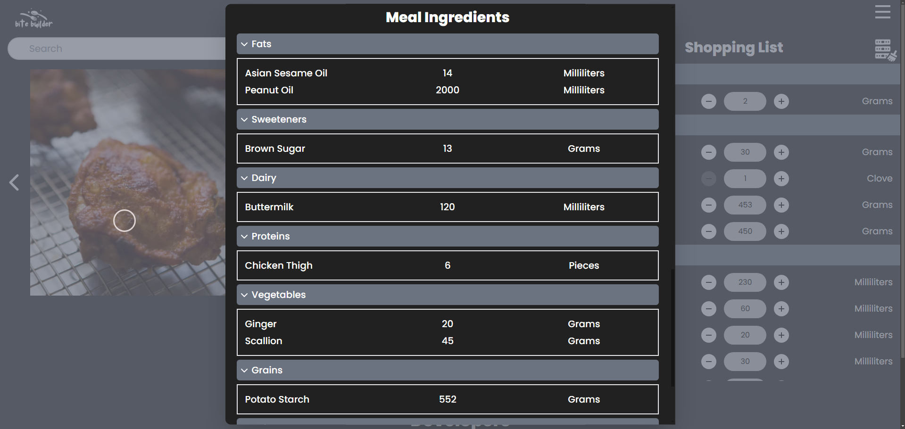
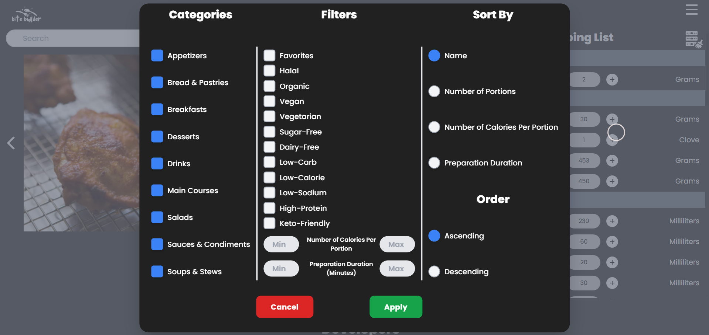
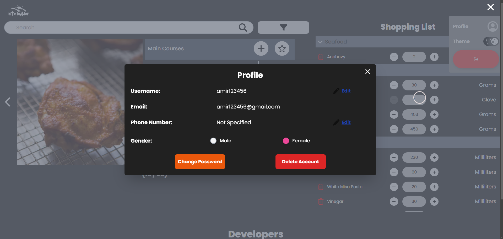

	

   

---

## Description

**Bite Builder** is a comprehensive platform designed to revolutionize meal planning by offering personalized meal and recipe suggestions tailored to user-selected dietary restrictions and meal categories. Beyond meal suggestions, the platform empowers users to create, customize, and manage shopping lists for their chosen meals, ensuring a seamless and efficient meal-planning experience. Whether users are looking for quick dinner ideas, managing dietary needs, or organizing their grocery shopping, Bite Builder provides a one-stop solution.

#### Technologies

- PHP
- MySQLi
- HTML
- Native + Tailwind CSS
- Vanilla JavaScript with Fetch API

#### Backend Overview

The backend architecture follows the **Model-View-Controller (MVC)** pattern, ensuring a clean separation of concerns. Key components include:

1. **Models**:
o	**Singleton Design Pattern**: Ensures secure database object creation and connection management.
o	Organized in a dedicated directory with sub-directories for table creation (DDL), indexes, insertions, stored procedures, functions, and triggers.
o	Utilizes advanced database tools such as **indexes, triggers, cursors, transactions, functions, and stored procedures** for efficient data management.
o	The database is implemented using **MySQLi (MariaDB)** and managed via **XAMPP**.

  

2. **Controllers**:
o	**17 controllers** in total, each handling specific functionalities.
o	**Global Controller**: Contains utility functions shared across all controllers.
o	**Error Handling**: Each controller's logic is wrapped in a try-finally block, with exceptions handled in the main controller file for each controller class. Success or error messages are sent to the frontend as JSON.

**Form Handling & Validation**

•	**User Registration**: Includes fields for username, email, password, and dietary preferences. Validations ensure unique usernames, unique email addresses and strong passwords.

•	**Meal Selection**: Users can filter meals by dietary restrictions and categories, as well as range input for the number of calories per serving and preparation duration. Moreover, users can choose the order in which the meals should be displayed (By name, by number of calories per serving…), and can search meals by name. Inputs are validated to ensure compatibility with the database.

•	**Shopping List Management**: Users can add, remove, or adjust ingredient quantities. Validations ensure accurate updates to the shopping list.

[Back To The Top](#top)

---

## User Interfaces

	
	<strong>Landing Page</strong>

	
	<strong>Login</strong>

	
	<strong>Meal Page</strong>

	
	<strong>Meal Details</strong>

	
	<strong>Meal Ingredients</strong>

	
	<strong>Preferences Popup</strong>

	
	<strong>Profile</strong>

---
## Project Team

##### Ahmad Mzayek
[LinkedIn](https://www.linkedin.com/in/ahmad-mzayek-97817330b) - [Email](mailto:ahmadmzayek.cs@gmail.com)

##### Amir Bou Ghanem
[LinkedIn](https://www.linkedin.com/in/amir-bou-ghanem) - [Email](mailto:amirbg43@hotmail.com)

##### Carla Kinaan
[LinkedIn](https://www.linkedin.com/in/carla-kinaan-4ba434333/) - [Email](mailto:carla.gms209@gmail.com)